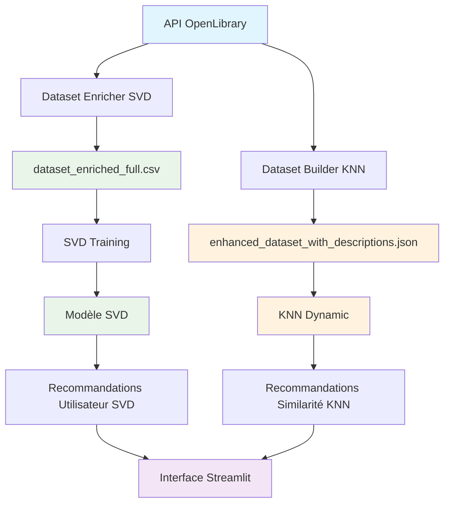

# 📚 Book Recommender System

> *Un système de recommandation de livres hybride intelligent utilisant SVD et KNN avec métadonnées enrichies*

[](https://www.python.org/)
[](https://streamlit.io/)
[](https://scikit-learn.org/)
[](https://www.docker.com/)
[](https://opensource.org/licenses/MIT)

## 🎯 Objectif du Projet

Ce projet implémente un **système de recommandation de livres hybride** qui combine plusieurs approches d'intelligence artificielle pour offrir des recommandations personnalisées et pertinentes. Le système utilise à la fois la **factorisation matricielle SVD** pour les recommandations basées sur les utilisateurs et **k-NN** pour les recommandations basées sur la similarité des livres.

### **Fonctionnalités principales :**
- 🧑‍💻 **Recommandations personnalisées** basées sur l'historique utilisateur
- 📚 **Recommandations par similarité** de livres
- 🌟 **Système hybride** combinant SVD et métadonnées enrichies
- 🔍 **Interface interactive** avec Streamlit
- 🏗️ **Construction automatique** de dataset via API
- 🚀 **Déploiement** Docker et Hugging Face Spaces

---

## 🏗️ Architecture du Système



### **Flux de Données Détaillé**

#### **Branche SVD (Recommandations Utilisateur)**
1. **API OpenLibrary** → Collecte des métadonnées
2. **Dataset Enricher** → Enrichit avec genres, années, éditeurs, descriptions
3. **CSV Enrichi** → Format : `[User-ID, Book-Title, Book-Rating, métadonnées...]`
4. **Entraînement SVD** → Factorisation matricielle
5. **Modèle SVD** → Prédictions utilisateur-livre

#### **Branche KNN (Recommandations par Similarité)**
1. **API OpenLibrary** → Collecte en temps réel
2. **Dataset Builder** → Construction dynamique par genres
3. **JSON Enrichi** → Format : `[{title, author, subjects, description...}]`
4. **KNN Dynamic** → Calcul de similarité cosinus
5. **Recommandations** → Top-K livres similaires

### **Pourquoi Deux Datasets ?**

| Aspect | SVD (CSV) | KNN (JSON) |
|--------|-----------|------------|
| **Objectif** | Relations User-Item-Rating | Métadonnées riches des livres |
| **Structure** | Tabulaire fixe | Objets flexibles |
| **Construction** | Batch (une fois) | Dynamique (temps réel) |
| **Stockage** | DataFrame pandas | Liste d'objets Python |
| **Sauvegarde** | CSV optimisé | JSON pour flexibilité |


---

## 🛠️ Technologies Utilisées

### **Machine Learning & Data Science**
- **Python 3.11** - Langage principal
- **scikit-learn** - Algorithmes ML (KNN, TF-IDF, StandardScaler)
- **scikit-surprise** - Factorisation matricielle SVD
- **pandas** - Manipulation de données
- **numpy** - Calcul scientifique

### **Interface & Visualisation**
- **Streamlit** - Interface web interactive
- **Plotly** - Visualisations interactives
- **HTML/CSS** - Personnalisation de l'interface

### **APIs & Données**
- **OpenLibrary API** - Métadonnées des livres
- **requests** - Appels API HTTP
- **json** - Manipulation de données JSON

### **Déploiement & Infrastructure**
- **Docker** - Conteneurisation
- **Hugging Face Spaces** - Hébergement cloud
- **Git LFS** - Gestion des gros fichiers
- **GitHub** - Contrôle de version

---

## 📊 Méthodologie des Recommandations

### **1. SVD Hybride (Recommandations Utilisateur)**
```python
Score Final = 60% × SVD + 25% × Genres + 10% × Années + 5% × Éditeurs
```

**Processus :**
1. Analyse des livres notés ≥7 par l'utilisateur
2. Extraction des genres préférés via TF-IDF
3. Détection des périodes et éditeurs favoris
4. Prédiction SVD combinée aux métadonnées
5. Scoring hybride pondéré

### **2. KNN (Similarité de Livres)**
```python
Features = TF-IDF(Auteur + Genres + Description + Éditeur) + Année_normalisée
Similarité = Cosinus(Features_livre_A, Features_livre_B)
```

**Processus :**
1. Vectorisation TF-IDF des features textuelles
2. Normalisation des features numériques
3. PCA réduction de dimensionalité
4. Calcul de similarité cosinus
5. Recherche des k plus proches voisins
6. Recommandations par score de similarité

---

## 🚀 Installation et Utilisation

### **Prérequis**
- Python 3.11+
- Git
- Docker (optionnel)

### **Installation locale**

1. **Cloner le repository**
```bash
git clone https://github.com/votre-username/Book_recommender.git
cd Book_recommender
```

2. **Créer un environnement virtuel**
```bash
python -m venv .venv
source .venv/bin/activate  # Linux/Mac
# ou
.venv\Scripts\activate     # Windows
```

3. **Installer les dépendances**
```bash
pip install -r requirements.txt
```

4. **Entraîner le modèle SVD**
```bash
python train.py
```

5. **Lancer l'application**
```bash
streamlit run app.py
```

### **Utilisation avec Docker**

```bash
# Construire l'image
docker build -t book-recommender .

# Lancer le conteneur
docker run -p 8501:8501 book-recommender
```

### **Déploiement sur Hugging Face Spaces**

1. Créer un nouveau Space sur [Hugging Face](https://huggingface.co/spaces)
2. Choisir "Docker" puis "Streamlit" comme SDK
3. Pousser le code vers le repository HF
4. Le déploiement se fait automatiquement

---

## 📁 Structure du Projet

```
book_recommender/
├── 📱 INTERFACE UTILISATEUR
│   ├── app.py                      # Point d'entrée principal
│   └── tabs/
│       ├── tab_svd.py              # Recommandations utilisateur
│       ├── tab_bookstore_demo.py   # Recommandations similarité
│       └── tab_dataset_builder.py  # Gestion dataset
│
├── 🤖 MOTEURS DE RECOMMANDATION
│   ├── utils.py                    # SVD hybride
│   ├── knn_dynamic.py              # KNN dynamique
│   └── train.py                    # Entraînement SVD
│
├── 🏗️ CONSTRUCTION DONNÉES
│   ├── KNN:
│   ├── dataset_builder.py          # Construction dataset pour le KNN
│   ├── build_dataset.py            
│   ├── api_utils.py                # Interface OpenLibrary
│   ├── SVD:
|   └── Ratings_enriched_optimized.csv      # dataset ratings kaggle avec métadonnées de l'API OpenLibrary
│
│
├── 📊 DONNÉES
│   ├── data/
│   │   ├── enhanced_dataset_with_descriptions.json (créé avec le dataset_builder pour le KNN)
│   │   └── Ratings_enriched_optimized.csv (pour le SVD)
│   └── artifacts/
│       ├── svd_model.pkl
│       ├── book_df.pkl
│       └── book_titles.pkl
│
└── 🔧 CONFIGURATION
    ├── requirements.txt
    ├── Dockerfile
    └── README.md
```

---

## 🎯 Étapes de Développement

### **Phase 1 : Préparation des Données**
1. **Collecte** via API OpenLibrary
2. **Nettoyage** et déduplication
3. **Enrichissement** avec métadonnées
4. **Validation** et formatage

### **Phase 2 : Développement des Algorithmes**
1. **Implémentation SVD** avec scikit-surprise
2. **Développement KNN** avec scikit-learn
3. **Système hybride** combinant SVD + métadonnées
4. **Optimisation** des performances

### **Phase 3 : Interface Utilisateur**
1. **Conception** de l'interface Streamlit
2. **Développement** des onglets interactifs
3. **Intégration** des moteurs de recommandation
4. **Tests** et validation UX

### **Phase 4 : Déploiement**
1. **Conteneurisation** Docker
2. **Optimisation** pour production
3. **Déploiement** sur Hugging Face Spaces
4. **Monitoring** et maintenance

---

## 📈 Métriques de Performance

### **Modèle SVD**
- **RMSE** : ~0.85 (sur échelle 1-10)
- **MAE** : ~0.67
- **Temps d'entraînement** : ~2 minutes (42k ratings)
- **Temps de prédiction** : ~50ms par utilisateur

### **KNN Dynamique**
- **Similarité cosinus** : 0.3-0.95
- **Temps de recommandation** : ~100ms
- **Couverture** : 100% des livres du dataset
- **Diversité** : Score moyen 0.7/1.0

### **Dataset**
- **Livres** : 4,317 livres enrichis
- **Utilisateurs** : 3,217 utilisateurs uniques
- **Ratings** : 42,331 évaluations
- **Métadonnées** : 70% couverture complète

---

## 🔧 Configuration et Personnalisation

### **Paramètres SVD Hybride**
```python
# Dans utils.py
HYBRID_WEIGHTS = {
    'svd_score': 0.60,      # Poids SVD
    'genre_score': 0.25,    # Poids genres
    'year_score': 0.10,     # Poids années
    'publisher_score': 0.05 # Poids éditeurs
}
```

### **Paramètres KNN**
```python
# Dans knn_dynamic.py
KNN_CONFIG = {
    'n_neighbors': 10,
    'metric': 'cosine',
    'algorithm': 'brute'
}
```

---

## 🐛 Dépannage

### **Problèmes courants**

#### **"Modèle SVD non trouvé"**
```bash
# Solution : Entraîner le modèle
python train.py
```

#### **"Dataset KNN vide"**
```bash
# Solution : Vérifier le JSON
python -c "from knn_dynamic import get_dynamic_knn; print(get_dynamic_knn().get_dataset_stats())"
```

#### **"Erreur API OpenLibrary"**
```bash
# Solution : Vérifier la connexion
python -c "from api_utils import get_api_client; get_api_client().test_connection()"
```

### **Logs et Debugging**
```bash
# Activer les logs détaillés
export STREAMLIT_LOGGER_LEVEL=debug
streamlit run app.py
```


## 📞 Contact

- **Auteur** : [Florent LEBRUN]
- **Email** : [flebrun67@gmail.com]
- **LinkedIn** : [www.linkedin.com/in/f-lebrun1989]
- **Portfolio** : [(https://github.com/FLebrun-67)]

---

## 🔗 Liens Utiles

- [🚀 **Démo Live**](https://huggingface.co/spaces/Beltzark/Book_recommender)
- [📖 **Documentation API**](https://openlibrary.org/developers/api)
- [🎓 **Cours ML**](https://www.jedha.co/)
- [📚 **Ressources Streamlit**](https://docs.streamlit.io/)

---

<div align="center">

**⭐ Si ce projet vous a été utile, n'hésitez pas à lui donner une étoile ! ⭐**

Made with ❤️ and lots of ☕

</div>